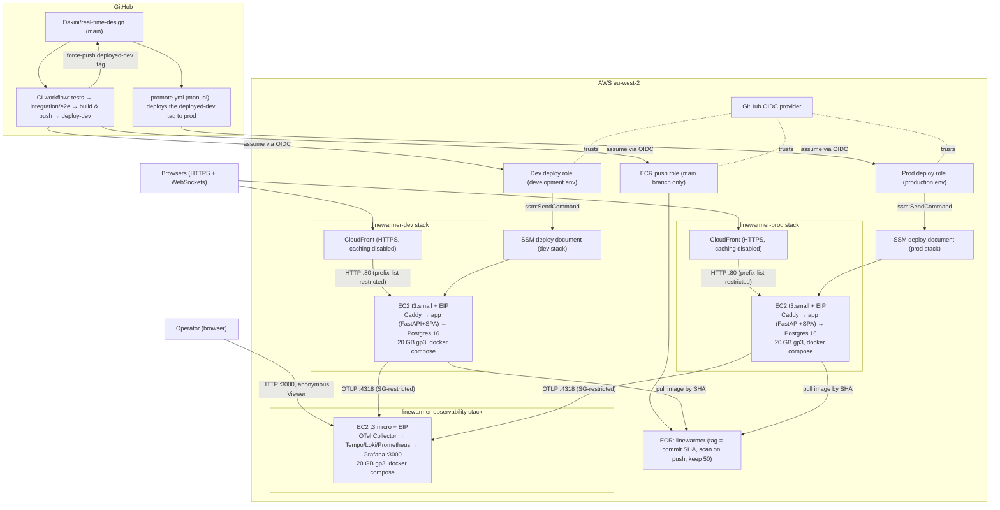

# Linewarmer Infrastructure

Four CloudFormation stacks in eu-west-2: `linewarmer-ecr` (shared image registry + CI push role),
two identical single-instance app stacks (`linewarmer-dev` and `linewarmer-prod`), and
`linewarmer-observability` - one shared instance both app stacks send telemetry to.

## Diagram

## How it works

**Build & deploy** (`.github/workflows/ci.yml`, `promote.yml`)

1. Every push to `main` runs backend, frontend, then integration/e2e tests.
2. `build-and-push` builds the single app image (Vite frontend baked into the FastAPI image)
   and pushes it to ECR tagged with the commit SHA, via an OIDC role scoped to `main` pushes.
3. `deploy-dev` assumes a deploy role that can only run the stack-owned SSM document against
   the dev instance: check out the commit in `/opt/app`, `docker compose up -d --pull always`
   with the SHA-tagged image. CI health-checks `/healthz`, then force-pushes `deployed-dev`.
4. `promote.yml` (manual) deploys whatever commit `deployed-dev` points at to prod — the same
   image bytes, never a rebuild.

**Runtime** (per environment, `infra/ec2-stack.yaml`)

One t3.small (2 GB RAM + 2 GB swap, 20 GB encrypted gp3) running three containers via
compose: Caddy (reverse proxy), the app (FastAPI + static SPA, WebSockets for the realtime
canvas), and Postgres 16 on a Docker volume on the root EBS volume. An Elastic IP fronts the
instance; CloudFront provides free HTTPS with caching disabled, and port 80 is restricted to
CloudFront's origin-facing prefix list. No SSH — SSM Session Manager only. The Postgres
password is generated at boot and lives only in `.env` on the instance.

Single-instance is deliberate: realtime session state is in-process, so the stack
intentionally avoids an ASG.

**Observability** (`infra/observability-stack.yaml`)

One t3.micro (1 GB RAM + 2 GB swap, 20 GB gp3) running the OTel Collector, Prometheus, Loki,
Tempo, and Grafana via `observability/docker-compose.yaml` - the same stack used locally, just
deployed once and shared. Both app instances export traces/metrics/logs to it over
`OTEL_EXPORTER_OTLP_ENDPOINT` (set from `ObservabilityCollectorEndpoint` on `ec2-stack.yaml`,
written to `.env` at boot); the security group only allows OTLP :4317/:4318 from the dev and prod
app instances' own security groups, by ID. Grafana itself (:3000) is open to the internet with
anonymous Viewer access, matching the local setup - there's no auth in front of it yet. Traces,
metrics, and logs from both environments land in the same Grafana, distinguished by the
`environment` resource attribute every signal already carries (`backend/app/telemetry.py`).

## Weak points and fixes (priority order)

1. **No database durability.** Postgres data sits on the instance's root EBS volume
   (`DeleteOnTermination` defaults to true) with no snapshots or dumps. `LatestAmiId` is an
   SSM-parameter type (`infra/ec2-stack.yaml:59`) that **re-resolves on every stack update**,
   so a routine template change can replace the instance and erase the database.
   *Fix:* nightly `pg_dump` to S3 (cron container or systemd timer), a daily Data Lifecycle
   Manager snapshot policy, and pin the AMI ID as a plain string parameter.
2. **Origin accepts any CloudFront distribution.** The prefix-list rule blocks the open
   internet, but anyone's distribution can point at the Elastic IP's public DNS name.
   *Fix:* inject a secret custom origin header in the distribution and have Caddy reject
   requests without it.
3. **Monitoring exists now, alerting doesn't.** Grafana has traces/metrics/logs from both
   environments, but nothing pages anyone - no CloudWatch alarms, no external check on
   `/healthz`, no Grafana alert rules on the existing dashboard.
   *Fix:* EC2 status-check alarm + Route 53 health check (or UptimeRobot) → SNS email; add a
   disk-usage alarm (Docker layers and Postgres WAL fill 20 GB quietly); Grafana alert rules on
   error-rate/latency panels.
4. **Grafana is public and unauthenticated.** Anyone with the observability instance's IP can
   read every trace, metric, and log from both dev and prod. Fine for now as a documented
   trade-off (same as local), not fine indefinitely.
   *Fix:* put it behind CloudFront + a Caddy/basic-auth layer like the app stacks, or switch to
   SSM port-forwarding only (no public exposure at all).
5. **Deploy blip, no rollback path.** `docker compose up -d` recreates the app container
   (seconds of 502s); rollback means manually invoking the SSM document with an old SHA.
   *Fix:* a `workflow_dispatch` "deploy this SHA to prod" workflow behind the same
   environment protection.
6. **WebSocket idle timeout.** `OriginReadTimeout: 60` drops WebSockets silent for 60 s —
   verify the app pings well under that.
7. **Smaller items.** Postgres password only on instance disk (Secrets Manager if needed);
   CloudFront→origin is plain HTTP (documented trade-off); enable stack termination
   protection on prod.

## Costs (~$59/month today)

| Item | Monthly (eu-west-2) |
|---|---|
| 2 × t3.small on-demand (app) | ~$34.50 |
| 1 × t3.micro on-demand (observability) | ~$7.60 |
| 3 × public IPv4 | ~$11.00 |
| 3 × 20 GB gp3 | ~$5.55 |
| ECR (~50 tagged images) + CloudFront | ~$1 (CloudFront 1 TB free tier) |

Savings options, by effort-to-savings:

1. **Graviton (t4g.small)** — ~$7/mo saved; needs a multi-arch image build
   (`docker buildx --platform linux/amd64,linux/arm64`) and the arm64 AMI parameter.
2. **Shrink or schedule dev** — ~$8–11/mo saved. Images are built in CI now, so the
   2 GB-for-npm-builds rationale is vestigial; dev likely runs on t4g.micro (~$6.90/mo).
   Or stop dev overnight/weekends via EventBridge Scheduler (~65% off dev compute).
3. **1-year no-upfront Compute Savings Plan on prod** — ~25–30% off prod compute.
4. **Trim ECR lifecycle from 50 to ~10 images** — small saving, zero cost.

Items 1 + 2 land around **$28–30/mo** with no architectural change.
